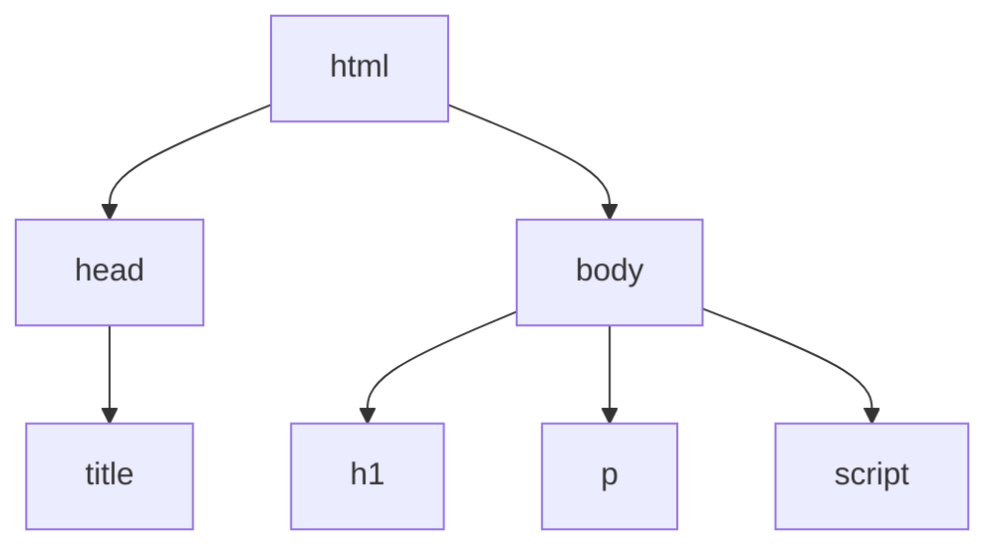
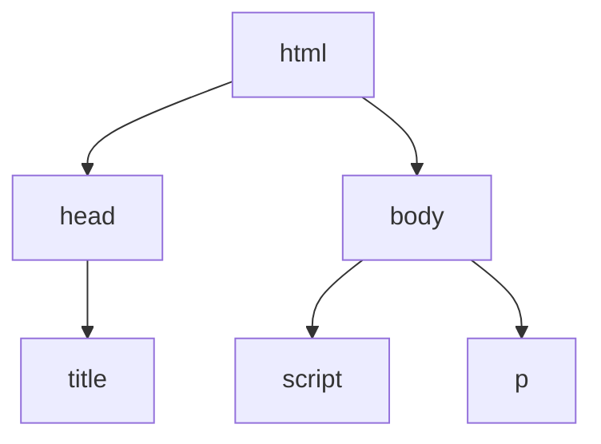

# Chrome DevTool's

Every browser has its own DevTools but will be focusing on Chrome. Chrome DevTools is a set of web developer tools built into Google Chrome browser. DevTools can help you edit pages on=the-fly and diagnose problems quickly, which ultematly helps you build better websites. 

## Open DevTools

There are many ways to open Devtools different users want different access to different parts to the DEvtools UI.
  
  For DOM or CSS, right click an element on the page and select Inspect to jump into the Elements panel. Or press Command=Options+C (Mac) or Control+Shift+C (Windows,Linux,ChromeOS).
  
  
  
  When you want to see logged messages or run Javascrip, press Command+Option+J (Mac) or Control+Shift+J (Windows,Linux,ChromeOS) to jump straight into the Console panel.
  
DevTools opens the Elements panel and selects the element in the DOM tree. In the Styles pane, you can see CSS rules applied to the selected element.

  
  

| OS | Elements |	Console	Your | last panel |
| -- | -------- | ------------ | ---------- |
| Windows or Linux | Ctrl + Shift + C | Ctrl + Shift + J | F12 Ctrl + Shift + I |
| Mac |	Cmd + Option + C | Cmd + Option + J | Fn + F12 Cmd + Option + I |

An easy way to memorize the shortcuts:

 - **C** stands for CSS.
 
 - **J** for JavaScript.

 - **I** designates your choice.
  
## DOM

There is a difference between HTML and the DOM.

When you use a web browser to request a page like https://example.com the server returns HTML like this:
<pre>
  <code>
    &lt;!doctype html&gt;
    &lt;html&gt;
      &lt;head&gt;
        &lt;title&gt;Hello, world!&lt;/title&gt;
      &lt;/head&gt;
      &lt;body&gt;
        &lt;h1>Hello, world!&lt;/h1&gt;
        &lt;p>This is a hypertext document on the World Wide Web.&lt;/p&gt;
        &lt;script src="/script.js" async>&lt;/script&gt;
      &lt;/body&gt;
    &lt;/html&gt;
   </code>
</pre>

The browser parses the HTML and creates a tree of objects like this:

This tree of objects, or nodes, representing the page's content is called the DOM. Right now it looks the same as the HTML, but suppose that the script referenced at the bottom of the HTML runs this code:

<pre>
  <code>
    const h1 = document.querySelector('h1');
    h1.parentElement.removeChild(h1);
    const p = document.createElement('p');
    p.textContent = 'Wildcard!';
    document.body.appendChild(p);
 </code>
</pre>

That code removes the h1 node and adds another p node to the DOM. The complete DOM now looks like this:

The page's HTML is now different than its DOM. In other words, HTML represents initial page content, and the DOM represents current page content. When JavaScript adds, removes, or edits nodes, the DOM becomes different than the HTML.
