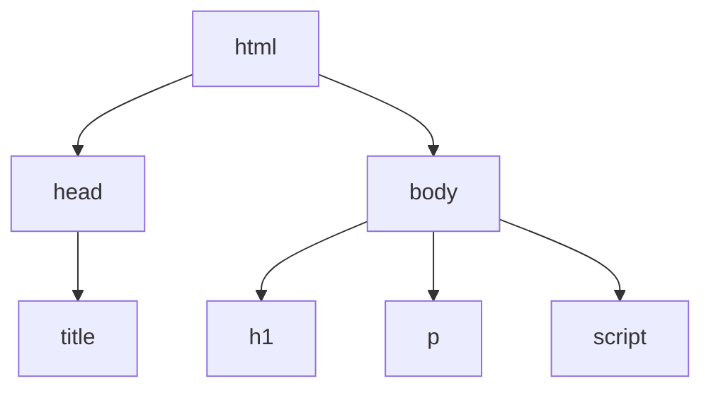
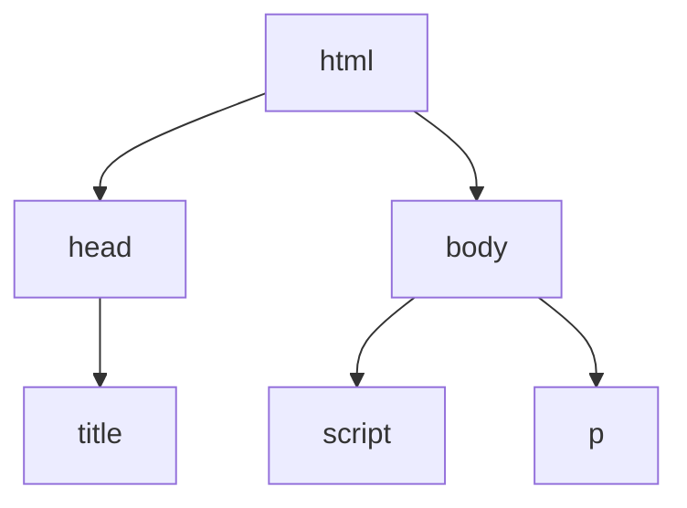

# Chrome DevTool's

Every browser has its own DevTools but will be focusing on Chrome. Chrome DevTools is a set of web developer tools built into Google Chrome browser. DevTools can help you edit pages on=the-fly and diagnose problems quickly, which ultematly helps you build better websites. 

## Open DevTools

There are many ways to open Devtools different users want different access to different parts to the DEvtools UI.
  
  For DOM or CSS, right click an element on the page and select Inspect to jump into the Elements panel. Or press Command=Options+C (Mac) or Control+Shift+C (Windows,Linux,ChromeOS).
  
  
  
  When you want to see logged messages or run Javascrip, press Command+Option+J (Mac) or Control+Shift+J (Windows,Linux,ChromeOS) to jump straight into the Console panel.
  
DevTools opens the Elements panel and selects the element in the DOM tree. In the Styles pane, you can see CSS rules applied to the selected element.

  
  

| OS | Elements |	Console	Your | last panel |
| -- | -------- | ------------ | ---------- |
| Windows or Linux | Ctrl + Shift + C | Ctrl + Shift + J | F12 Ctrl + Shift + I |
| Mac |	Cmd + Option + C | Cmd + Option + J | Fn + F12 Cmd + Option + I |

An easy way to memorize the shortcuts:

 - **C** stands for CSS.
 
 - **J** for JavaScript.

 - **I** designates your choice.
  
## DOM

There is a difference between HTML and the DOM.

When you use a web browser to request a page like https://example.com the server returns HTML like this:
<pre>
  <code>
    &lt;!doctype html&gt;
    &lt;html&gt;
      &lt;head&gt;
        &lt;title&gt;Hello, world!&lt;/title&gt;
      &lt;/head&gt;
      &lt;body&gt;
        &lt;h1>Hello, world!&lt;/h1&gt;
        &lt;p>This is a hypertext document on the World Wide Web.&lt;/p&gt;
        &lt;script src="/script.js" async>&lt;/script&gt;
      &lt;/body&gt;
    &lt;/html&gt;
   </code>
</pre>

The browser parses the HTML and creates a tree of objects like this:

This tree of objects, or nodes, representing the page's content is called the DOM. Right now it looks the same as the HTML, but suppose that the script referenced at the bottom of the HTML runs this code:

<pre>
  <code>
    const h1 = document.querySelector('h1');
    h1.parentElement.removeChild(h1);
    const p = document.createElement('p');
    p.textContent = 'Wildcard!';
    document.body.appendChild(p);
 </code>
</pre>

That code removes the h1 node and adds another p node to the DOM. The complete DOM now looks like this:

The page's HTML is now different than its DOM. In other words, HTML represents initial page content, and the DOM represents current page content. When JavaScript adds, removes, or edits nodes, the DOM becomes different than the HTML.

## View DOM Nodes

The DOM Tree of the Elements panel is where you do all DOM-related activities in DevTools.

### Inspect a node

When you're interested in a particular DOM node, Inspect is a fast way to open DevTools and investigate that node.

 1 Right-click Michelangelo below and select Inspect.
  * Michelangelo
  * Raphael

The **Elements** panel of DevTools opens. <li>Michelangelo</li> is highlighted in the **DOM Tree**.

2 Click the **Inspect** icon in the top-left corner of DevTools.

 
3 Click the **Tokyo** text below.
 * Tokyo
 * Beirut
  
Now, <n><code>&lt;li&gt;Tokio&lt;/li&gt;</code></n> is highlighted in the DOM Tree.

## Navigate the DOM Tree with a keyboard

Once you've selected a node in the DOM Tree, you can navigate the DOM Tree with your keyboard.

1 Right-click **Ringo** below and select **Inspect**. <n><code>&lt;li&gt;Ringo&lt;/li&gt; </code></n> is selected in the DOM Tree.
 * George
 * Ringo
 * Paul
 * John

2 Press the Up arrow key 2 times. <n><code>&lt;ul&gt;</code></n> is selected.

3 Press the Left arrow key. The <n><code>&lt;ul&gt;</code></n> list collapses.

4 Press the Left arrow key again. The parent of the <n><code>&lt;ul&gt;</code></n> node is selected. In this case it's the <n><code>&lt;li&gt;</code></n> node containing the instructions for step 1.

5 Press the Down arrow key 3 times so that you've re-selected the <n><code>&lt;ul&gt;</code></n> list that you just collapsed. It should look like this:<n><code>&lt;ul&gt;...&lt;ul&gt;</code></n>

6 Press the Right arrow key. The list expands.

### Scroll into view

When viewing the DOM Tree, sometimes you'll find yourself interested in a DOM node that's not currently in the viewport. For example, suppose that you scrolled to the bottom of the page, and you're interested in the <n><code>&lt;h1&gt;</code></n> node at the top of the page. **Scroll into view** lets you quickly reposition the viewport so that you can see the node.

1 Right-click **Magritte** below and select **Inspect.**
  * Magrite
  * Soutine

2 Go to the [Appendix: Scroll into view](#appendix-scroll-into-view) section at the bottom of this page. The instructions continue there.

After completing the instructions at the bottom of the page you should jump back up to here.

## Show rulers

With rulers above and to the left of your viewport, you can measure the width and height of an element when you hover over it in the **Elements panel**.

Enable the rulers in one of two ways:

 * Press Control+Shift+P or Command+Shift+P (Mac) to open the **Command menu**, type Show rulers on hover, and press Enter.

 * Check Settings. **Settings > Preferences > Elements > Show** rulers on hover.

The sizing unit of the rulers is pixels.

## Search for nodes

You can search the DOM Tree by string, CSS selector, or XPath selector.

 1 Focus your cursor on the **Elements** panel.

 2 Press Control+F or Command+F (Mac). The Search bar opens at the bottom of the DOM Tree.

 3 Type The Moon is a Harsh Mistress. The last sentence is highlighted in the DOM Tree.
 
 
 As mentioned above, the Search bar also supports CSS and XPath selectors.

The **Elements** panel selects the first matching result in the DOM tree and rolls it into view in the viewport. By default, this happens as you type. If you always work with long search queries, you can make DevTools run search only when you press Enter.

To avoid unnecessary jumps between nodes, clear the **Settings > Preferences > Global > Search as you type checkbox**.

 
## Edit the DOM

You can edit the DOM on the fly and see how those changes affect the page.

### Edit content

To edit a node's content, double-click the content in the DOM Tree.

 1 Right-click Michelle below and select Inspect.
  * Fry
  * Michelle

 2 In the DOM Tree, double-click Michelle. In other words, double-click the text between <n><code>&lt;li&gt; and &lt;/li&gt;</code></n>. The text is highlighted blue to indicate that it's selected.

 
 3 Delete Michelle, type Leela, then press Enter to confirm the change. The text above changes from **Michelle** to **Leela**.

### Edit attributes

To edit attributes, double-click the attribute name or value. Follow the instructions below to learn how to add attributes to a node.

 1 Right-click **Howard** below and select **Inspect**.
  * Howard
  * Vince
 
 2 Double-click <n><code>&lt;li&gt;</code></n>. The text is highlighted to indicate that the node is selected.
  

 3 Press the Right arrow key, add a space, <n><code>type style="background-color:gold"</code></n>, and then press Enter. The background color of the node changes to gold.
  
 
### Edit node type

To edit a node's type, double-click the type and then type in the new type.

 1 Right-click **Hank** below and select **Inspect**.
  * Dean
  * Hank
  * Thaddeus
  * Brock

 2 Double-click <n><code>&lt;li&gt;</code></n>. The text li is highlighted.
 
 3 Delete li, type button, then press Enter. The <n><code>&lt;li&gt;</code></n> node changes to a <n><code>&lt;button&gt;</code></n> node.
 

### Edit as HTML

To edit nodes as HTML with syntax highlighting and autocomplete, select ***Edit as HTML** from the node's drop-down menu.

 1 Right-click **Leonard** below and select **Inspect**.
  * Penny
  * Howard
  * Rajesh
  * Leonard

  2 In the **Elements** panel, right-click the current node and select **Edit as HTML** from the drop-down menu.
  

3 Press Enter to start a new line and start typing <l. DevTool highlights HTML syntax and autocompletes tags for you.
 

4 Select the <n><code>li</code></n> element from the autocomplete menu and type <n><code>&gt;</code></n>. DevTools automatically adds the closing <n><code>&lt;/li&gt;</code></n>tag after the cursor.
 

5 Type <n><code>Sheldon</n></code> inside the tag and press Control / Command + Enter to apply changes.
 
 
 ### Reorder DOM nodes

Drag nodes to reorder them.

 1 Right-click **Elvis Presley** below and select **Inspect**. Notice that it's the last item in the list.

  * Stevie Wonder
  * Tom Waits
  * Chris Thile
  * Elvis Presley

 2 In the DOM Tree, drag <n><code>&lt;li&gt; Elvis Presley&lt;li&gt; </code></n> to the top of the list.
 

### Force state 

You can force nodes to remain in states like <n><code>:active</code></n>, <n><code>:hover</code></n>, <n><code>:focus</code></n>, <n><code>:visited</code></n>, and <n><code>:focus-within</code></n>.

1 Hover over **The Lord of the Flies** below. The background color becomes orange.
 * The Lord of the Flies
 * Crime and Punishment
 * Moby Dick

2 Right-click **The Lord of the Flies** above and select **Inspect**.

3 Right-click <n><code>&lt;li class="demo--hover"&gt;The Lord of the Flies&lt;/li&gt;</code></n> and select **Force State** > **:hover**. See[Appendix: Missing options](#appendix-missing-options)  if you don't see this option. The background color remains orange even though you're not actually hovering over the node.

### Hide a node
 
Press H to hide a node

 1 Right-click **The Stars My Destination** below and select **Inspect**.

  * The Count of Monte Cristo
  * The Stars My Destination
  
 2 Press the H key. The node is hidden.
 
 
 3 Press the H key again. The node is shown again.
 
### Delete a node

 1 Rigth-click **Foundation** below and select **Inspect**
  * The Illustrated Man
  * Through the Looking-Glass
  * Foundation

 2 Press the Delete key. The node is deleted.
 
 3 Press Control+Z or Command+Z (Mac). The last action is undone and the node reappears.
 
## Access nodes in the Console

DevTools provides a few shortcuts for accessing DOM nodes from the Console, or getting JavaScript references to them.

### Reference the currently-selected node with $0

When you inspect a node, the <n><code>&lt;== $0&gt;</code></n> text next to the node means that you can reference this node in the Console with the variable <n><code>&lt;$0&gt;</code></n>.

 1 Right-click **The Left Hand of Darkness** below and select **Inspect**.
  * The Left Hand of Darkness
  * Dune
 
 2 Press the Escape key to open the Console Drawer
 
 3 Type <n><code>&lt;$0&gt;</code></n> and press the Enter key. The result of the expression shows that <n><code>&lt;$0&gt;</code></n> evaluates to <n><code>&lt;li&gt; The Left Hand of Darkness &lt;/li&gt;</code></n>

 4 Hover over the result. The node is highlighted in the viewport.
 
 5 Click  <n><code>&lt;li&gt;Dune&lt;/li&gt;</code></n> in the DOM Tree, type <n><code>&lt;$0&gt;</code></n> in the Console again, and then press Enter again. Now, <n><code>&lt;$0&gt;</code></n> evaluates to <n><code>&lt;li&gt;Dune&lt;/li&gt;</code></n>.
 
### Store as global variable

If you need to refer back to a node many times, store it as a global variable.

 1 Right-click **The Big Sleep** below and select **Inspect**.

  * The Big Sleep
  * The Long Goodbye

 2 Right-click <n><code>&lt;li&gt;The Big Sleep&lt;/li&gt;</code></n> in the DOM Tree and select **Store as global variable**. See [Appendix: Missing options](#missing-options)  if you don't see this option. <n>
 
 3 Type <n><code>temp1</code></n>  in the Console and then press Enter. The result of the expression shows that the variable evaluates to the node.
 

### Copy JS Path

Copy the JavaScript path to a node when you need to reference it in an automated test.

 1 Right-click **The Brothers Karamazov** below and select **Inspect**.
  * The Brothers Karamazov
  * Crime and Punishment

 2 Right-click <n><code>&lt;li&gt;The Brothers Karamazov&lt;/li&gt;</code></n> in the DOM Tree and select **Copy > Copy JS Path**. A <n><code>document.querySelector()</code></n> expression that resolves to the node has been copied to your clipboard.
  
 3 Press Control+V or Command+V (Mac) to paste the expression into the Console.
  
 4 Press Enter to evaluate the expression.

## Next steps
That covers most of the DOM-related features in DevTools. You can discover the rest of them by right-clicking nodes in the DOM Tree and experimenting with the other options that weren't covered in this tutorial
  
## Appendix: Scroll into view
 
 This is a continuation of the [Scroll into view](#scroll-into-view) section. Follow the instructions below to complete the section.
  
  1 The <n><code>&lt;li&gt;Magritte&lt;/li&gt;</code></n> node should still be selected in your DOM Tree. If not, go back to Scroll into view and start over.

 2 Right-click the <n><code>&lt;li&gt;Magritte&lt;/li&gt;</code></n> node and select **Scroll into view**. Your viewport scrolls back up so that you can see the **Magritte** node. See [Appendix: Missing options](#appendix-missing-options) if you can't see the **Scroll into view** option.
  

  
## Appendix: Missing options
  
Many of the instructions in this tutorial instruct you to right-click a node in the DOM Tree and then select an option from the context menu that pops up. If you don't see the specified option in the context menu, try right-clicking away from the node text.

 
 
 
 
